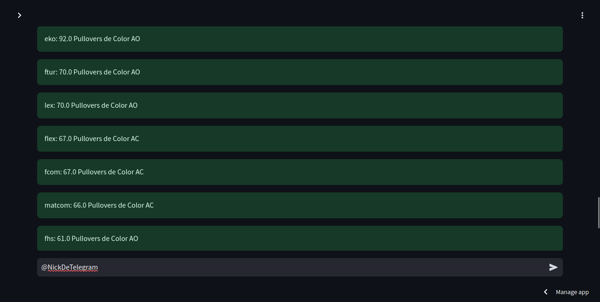

# Distribución de pullovers en los Juegos Caribe.

## Modelos Matemáticos Aplicados.


## Autores:

- **Daniel Machado Pérez** (C311) [@DanielMPMatCom](https://github.com/DanielMPMatCom)
- **Osvaldo R. Moreno Prieto** (C311) [@Val020213](https://github.com/Val020213)
- **Daniel Toledo Martínez** (C311) [@Phann020126](https://github.com/Phann020126)

## Índice.

- [Distribución de pullovers en los Juegos Caribe.](#distribución-de-pullovers-en-los-juegos-caribe)
  - [Modelos Matemáticos Aplicados.](#modelos-matemáticos-aplicados)
  - [Autores:](#autores)
  - [Índice.](#índice)
  - [Introducción.](#introducción)
  - [Algoritmos Heurísticos y de Búsqueda Local.](#algoritmos-heurísticos-y-de-búsqueda-local)
  - [Programación Lineal Entera Mixta (MILP).](#programación-lineal-entera-mixta-milp)
  - [Metodología y Formulación del Problema de Optimización.](#metodología-y-formulación-del-problema-de-optimización)
      - [Datos de Entrada.](#datos-de-entrada)
      - [Pasos del Algoritmo.](#pasos-del-algoritmo)
  - [PuLP: Biblioteca de Optimización Lineal en Python.](#pulp-biblioteca-de-optimización-lineal-en-python)
      - [Características Principales.](#características-principales)
  - [Modo de Uso.](#modo-de-uso)
    - [Maual de Usuario.](#maual-de-usuario)
  - [Bitácora del Proyecto.](#bitácora-del-proyecto)

## Introducción.

El problema de la distribución de pullovers en el contexto de un evento deportivo universitario involucra diversas restricciones y objetivos que lo convierten en un desafío complejo de optimización. Existen múltiples enfoques para abordar problemas de esta naturaleza, entre los cuales destacan la Programación Lineal Entera Mixta (MILP), los Algoritmos Genéticos (GA), el Simulated Annealing (SA), y los Algoritmos de Búsqueda Local como el *hill climbing* y *tabu search*. Este informe tiene como objetivo comparar estos métodos, argumentando por qué MILP representa una solución más robusta y adecuada para el problema en cuestión. El problema a resolver consiste en distribuir un número limitado de pullovers entre varias facultades, de modo que se respeten diversas restricciones, que tienen que ver con la cantidad disponible de colores, la cantidad de atletas inscritos en cada facultad, y la asignación equitativa basada en rankings y preferencias de color. Además, se busca maximizar el cumplimiento de restricciones de prioridad y minimizar las diferencias entre las razones de asignación de pullovers y atletas inscritos.

## Algoritmos Heurísticos y de Búsqueda Local.

Los algoritmos heurísticos como los Algoritmos Genéticos (GA) y Simulated Annealing (SA), así como los métodos de búsqueda local como *hill climbing* y *tabu search*, son técnicas populares para resolver problemas de optimización complejos, especialmente cuando el espacio de soluciones es grande y la solución óptima no puede ser calculada de manera eficiente. Estas técnicas tienen la ventaja de ser más rápidas y menos exigentes en términos de recursos computacionales en comparación con MILP, especialmente en problemas de gran escala.

Sin embargo, estos métodos presentan varias limitaciones significativas cuando se comparan con MILP en el contexto del problema en cuestión:

1. Soluciones Aproximadas y No Óptimas: Los algoritmos heurísticos y de búsqueda local, por su naturaleza, tienden a encontrar soluciones aproximadas que no garantizan la optimalidad. En un problema donde cumplir con todas las restricciones es crítico, la capacidad de encontrar la solución óptima es esencial, y MILP garantiza esto siempre que el problema sea resoluble en tiempo razonable.
2. Dificultad para Manejar Múltiples Restricciones Complejas: Aunque los algoritmos heurísticos pueden ser adaptados para manejar múltiples restricciones, la combinación de restricciones estrictas y prioritarias, como en este problema, es difícil de implementar de manera eficiente. Por ejemplo, en GA o SA, diseñar una función de aptitud que maneje adecuadamente todas las restricciones y prioridades puede ser complejo y a menudo requiere afinaciones finas específicas para cada problema, lo cual reduce la generalidad del método.
3. Control Limitado sobre la Prioridad de Restricciones: En MILP, es posible definir de manera precisa la prioridad entre las restricciones utilizando técnicas como el método de *weighted sum* o *lexicographic optimization*. Por otro lado, en métodos como GA o SA, la priorización de restricciones puede no ser tan directa y puede depender de penalizaciones en la función objetivo, lo que introduce un elemento de incertidumbre en la calidad de las soluciones obtenidas.
4. Riesgo de Estancamiento en Óptimos Locales: Los métodos de búsqueda local como *hill climbing* y *tabu search* son susceptibles a quedar atrapados en óptimos locales, especialmente en problemas de alta complejidad como el presente. Aunque existen técnicas para mitigar este riesgo, como la diversificación en *tabu search* o el uso de operadores de mutación en GA, estas no garantizan la escapatoria de un óptimo local y pueden requerir tiempos de ejecución significativamente mayores para lograr soluciones de calidad.

## Programación Lineal Entera Mixta (MILP).

MILP es un enfoque de optimización exacto que permite modelar problemas con restricciones lineales y variables de decisión enteras. La fortaleza de MILP radica en su capacidad para encontrar soluciones óptimas garantizadas, siempre y cuando el problema sea formulado adecuadamente y los recursos computacionales lo permitan. La naturaleza combinatoria del problema de distribución de pullovers, que involucra múltiples restricciones y variables discretas, hace que MILP sea especialmente apropiado, ya que puede manejar la complejidad del problema y proporcionar soluciones óptimas que satisfacen todas las restricciones impuestas.

Además, MILP permite la incorporación explícita de prioridades entre restricciones, lo que es crucial en este caso, dado que algunas restricciones son innegociables mientras que otras pueden ser relajadas si es necesario. Este control granular sobre las restricciones es difícil de replicar en enfoques heurísticos.

## Metodología y Formulación del Problema de Optimización.

#### Datos de Entrada.

El algoritmo recibe los siguientes datos de entrada:

1. Facultades: Lista de facultades participantes.
2. Atletas: Diccionario que mapea cada facultad con la cantidad de atletas inscritos.
3. Ranking: Diccionario que asigna un ranking a cada facultad.
4. Pullovers Disponibles: Diccionario con la cantidad total de pullovers disponibles por color.
5. Pullovers para Árbitros y Profesores: Cantidad fija de pullovers destinados a árbitros y profesores.
6. Pullovers para AAAC: Cantidad fija de pullovers destinados a la Asociación de Antiguos Atletas Caribe (AAAC).
7. Preferencias: Diccionario opcional que indica la preferencia de color de cada facultad.

#### Pasos del Algoritmo.

1. Asignación a Árbitros, Profesores y AAAC:

   * El algoritmo selecciona aleatoriamente un color para los árbitros, profesores y AAAC.
   * Se distribuye una cantidad fija de pullovers a estos grupos, reduciendo el total disponible para las facultades.
2. Asignación Inicial para Facultades con Menos de 10 Atletas:

   * Las facultades con menos de 10 atletas reciben sus pullovers de forma directa, asignándoles un color (preferido o aleatorio) y reduciendo el total disponible.
3. Optimización Principal:

   * Se modela un problema de optimización lineal para asignar los pullovers restantes a las facultades con más de 10 atletas.
   * Variables de Decisión:

     $x_i$ : Cantidad de pullovers asignados a la facultad $i$.

     $y_{ij}$ : Variable binaria que indica si la facultad $i$ recibe el color $j$.

     $z_{ij}$ : Cantidad de pullovers asignados a la facultad $i$ del color $j$.

     $proporciones_i$ : Proporción de pullovers asignados respecto al número de atletas de la facultad $i$.

     $diferencia_i$ : Diferencia absoluta entre la proporción asignada y la media.
   * Restricciones:

     - La suma total de pullovers asignados debe ser igual al total disponible.
     - Cada facultad recibe exactamente un color.
     - Ninguna facultad recibe más pullovers de los que hay disponibles de un color.
     - Ninguna facultad se queda con $0$ colores.
     - La proporción de pullovers asignados a cada facultad debe acercarse lo más posible a la media.
   * Otras restricciones en orden de prioridad (El algoritmo tratará de cumplir la mayor cantidad de restricciones respentando la prioridad asignada):

     1. La cantidad de pullovers que recibe una facultad es menor o igual a la cantidad de atletas inscritos en dicha facultad.
     2. Una facultad no tendrá menos pullovers que otra que esté por debajo de ella en el ranking actual de los juegos.
     3. Si una facultad tiene menos de 10 atletas inscritos, recibe todos los pullovers para sus atletas.
     4. Si $A$ es una facultad que tiene más atletas inscritos que otra facultad $B$, entonces $A$ recibe más pullovers que $B$.
     5. Si a una facultad $A$ se le van a asignar $n$ pullovers, y existen al menos $n$ pullovers disponibles del color favorito de $A$, se le deben asignar dichos pullovers a $A$.
   * Función Objetivo:

     - Minimizar la suma de las diferencias absolutas entre la proporción de pullovers asignados y la media.
4. Resolución:

   * El problema de optimización se resuelve utilizando el solver `PuLP` con un límite de tiempo para garantizar la eficiencia en la solución.
5. Salida:

   * El algoritmo imprime la cantidad de pullovers asignados a cada facultad, junto con el color asignado. También proporciona un resumen de la distribución total por color.

## [PuLP](https://pypi.org/project/PuLP/): Biblioteca de Optimización Lineal en Python.

`PuLP` es una biblioteca de código abierto para Python diseñada específicamente para modelar y resolver problemas de optimización lineal y entera. Proporciona una interfaz sencilla y flexible que permite a los usuarios definir variables de decisión, funciones objetivo y restricciones de manera intuitiva, utilizando una sintaxis similar al lenguaje matemático convencional.

#### Características Principales.
   1. **Modelado Intuitivo**: `PuLP` facilita la formulación de problemas de optimización mediante la creación de variables, la definición de la función objetivo y la incorporación de restricciones de manera clara y estructurada.
   2. **Compatibilidad con Múltiples Solvers**: La biblioteca puede integrarse con diversos solvers de optimización, tanto de código abierto como comerciales, como `CBC`, `CPLEX`, `Gurobi` y `GLPK`, lo que brinda flexibilidad para elegir la herramienta más adecuada según las necesidades del problema.
   3. **Soporte para Optimización Entera y Lineal**: Además de resolver problemas de programación lineal, `PuLP` también permite manejar variables enteras, lo que es esencial para aplicaciones que requieren soluciones discretas.
   4. **Documentación y Comunidad Activa**: `PuLP` cuenta con una amplia documentación y una comunidad activa que facilita el aprendizaje y la resolución de dudas, lo que la convierte en una opción accesible tanto para principiantes como para usuarios avanzados.


## Modo de Uso.

[Link](https://caribe.streamlit.app/) para abrir la aplicación.

Para correr la aplicación se puede ejecutar el siguiente código desde una terminal en la carpeta raíz del repositorio:

```streamlit run src/main.py```

### Maual de Usuario.


Pantalla principal de la aplicación


Primeramente se introducen los datos relacionados a las cantidades de pullovers fijas para Árbitros, Profesores y Antiguos Atletas. Luego se selecciona la cantidad de colores moviendo el slider con el mouse o con las flechas del teclado. Se introducen los nombres y la cantidad de pullovers disponibles de cada color.


De manera similar se selecciona la cantidad de facultades a las que se les va a repartir pullovers y se rellenan los datos pertinentes. La aplicación le avisará si le faltan datos por brindar al ejecutar la solución. Se recomienda siempre rellenar el dato de la Cantidad de Atletas, y en el caso de no tener la exactitud del dato, brindar un aproximado basado en años anteriores para que la solución sea lo mejor posible.


 

Al completar los datos necesarios, se puede pulsar el botón `Ejecutar`. Se tomará un tiempo relativamente corto e imprimirá los resultados.


En la esquina superior derecha se podrá encontrar un menú desplegable.


Una de las opciones disponibles al entrar a `Settings` es la de cambiar el Tema de la aplicación.


Por último en ese mismo menú, al entrar a `Print` se podrá obtener una versión en `PDF` de la ejecución de la aplicación, pudiendo guardar de esta manera los resultados y los datos de entrada que los generaron.

## Bitácora del Proyecto.

1. Elegir Proyecto.
2. Comunicarse con el cliente vía digital.
3. Encuentro presencial con el cliente.
4. Estudiar las tecnologías
5. Mostrar plantilla de figma con el primer diseño de la aplicación al cliente.
6. Cambio de diseño de la aplicación.
7. Estudio de los métodos de solución del problema a resolver.
8. En paralelo: Desarrollo de la aplicación y exploración de métodos de soluciones al problema.
9. Elección del método de solución, iteraciones de prueba para mejorar la solución. Avance en el desarrollo de la aplicación.
10. Consultas al cliente sobre los requerimientos y la prioridad de las restricciones del problema. Cambio de tecnología en el desarrollo de la aplicación por incompatibilidad con paquetes de python (Flutter a Flet).
11. Modificaciones al código y aproximación a la solución definitiva. En paralelo continúa el desarrollo de la aplicación con la nueva tecnología.
12. Encontrada solución al problema, arreglando detalles. Aplicación casi terminada.
13. Problemas con los paquetes de python al integrar ambas partes (Permisos de la app al ser ejecutada en android debido al uso de la consola). Nueva incopatibilidad de las tecnologías. Búsqueda de posibles soluciones.
14. Consulta al cliente sobre posible cambio de tecnología al no encontrar solución al problema.
15. Finalmente cambio de tecnología (streamlit) y de concepción de la apliación. Nuevo proceso de desarrollo e investigación de la nueva tecnología.
16. Producto funcional. 
